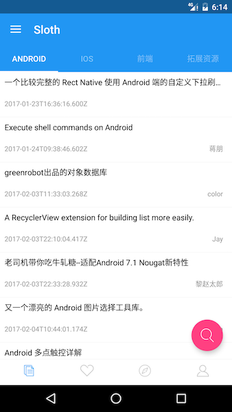
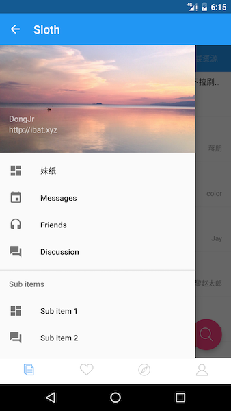

## Sloth  
### 项目介绍:  

	   这是一个用于Android学习的项目，使用了代码家的http://gank.io中的接口,
	里面内容包括，Rxjava,Retroft,,Picasso,WebView预览图片,图片预览放大、
	缩小、移动，Material Design控件使用和activity切换动画等.
	   目前代码结构还不是很好,以后会慢慢重构.有新的技术也会不断往项目里面添加.
	希望能通过这个项目技术有一定得提升

### 效果:  
  
  
  
  
  
